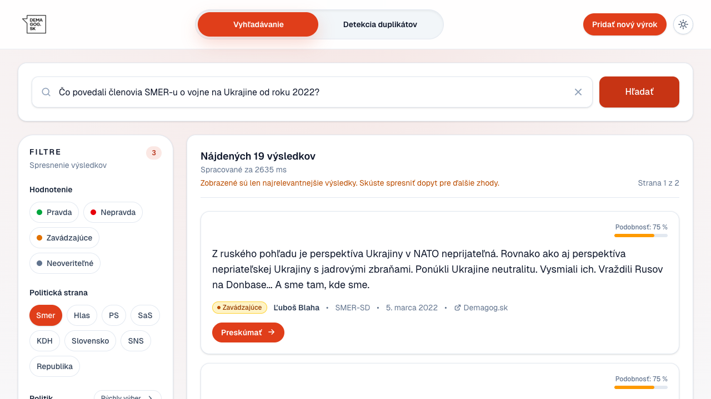
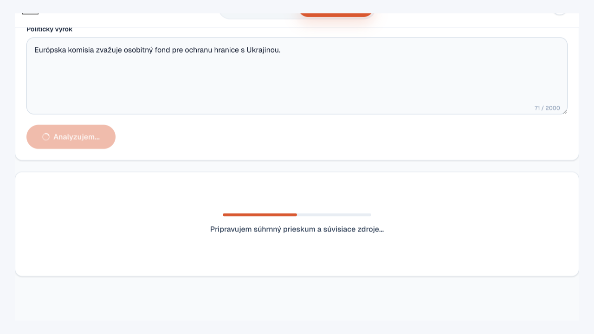
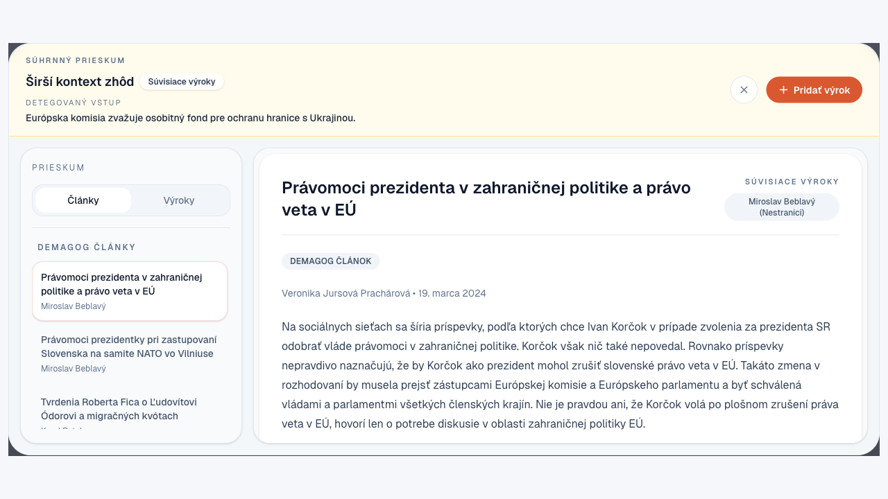
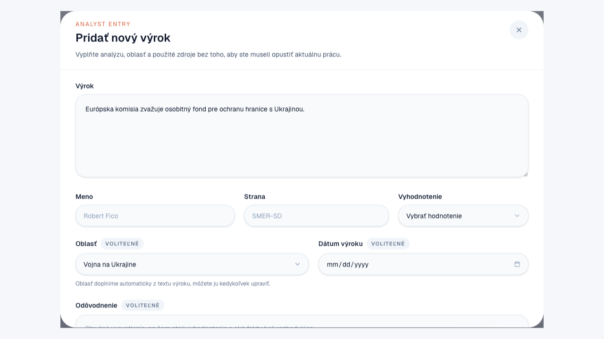

# Demagog: interný nástroj na rešerš a kontrolu výrokov

Tento prototyp pomáha redakcii rýchlo zistiť, či Demagog podobný výrok už overoval. Vyhľadávanie a detekcia duplicít sú spojené v jednom rozhraní, takže sa dá plynulo prejsť od prvého preverenia k širšiemu prieskumu alebo k pridaniu nového záznamu.

Pri prvom otvorení vás prevedie krátky vstavaný návod. Neskôr sa k nemu vrátite cez tlačidlo **`Návod`**.

## Ako sa v nástroji začína

Vo Vyhľadávaní môžete začať témou, menom, citátom alebo otázkou vlastnými slovami. Keď už máte konkrétne tvrdenie, prepnite sa do Detekcie duplicít.

  

## Čo sa stane po odoslaní tvrdenia

Detekcia po odoslaní vždy najprv spraví rýchlu kontrolu proti archívu. Ak sa nič podobné nenájde, hneď sa zobrazí stav nového výroku. Ak sa podobné staršie výroky nájdu, aplikácia zostane v jednom spoločnom stave prípravy a začne chystať súhrnný prieskum.

Keď sú podklady hotové, pracovný priestor sa otvorí automaticky. Nie je tu žiadne ďalšie potvrdzovanie ani ručné tlačidlo na prípravu prieskumu. Ak príprava zlyhá, používateľ sa vráti ku kartám zhôd s možnosťou skúsiť to znova.

  

## Súhrnný prieskum a pokračovanie v práci

Súhrnný prieskum spojí podobné výroky, články Demagogu a ďalšie zdroje do jedného pracovného priestoru. Vľavo sa prepínajú kategórie, v hlavnej časti sa číta vybraný materiál. Keď sa ukáže, že pripravené podklady nestačia, formulár na nový záznam sa otvorí priamo odtiaľ.

  

  

Samostatná stránka **`/add`** stále existuje, ale pri bežnej práci väčšinou stačí kontextové otvorenie formulára priamo z prieskumu.

## Spätná väzba

Toto README je len stručný prehľad pre interné použitie. Ak pri skúšaní narazíte na chybu, nejasnosť alebo máte nápad na zlepšenie, napíšte nám priamo cez tlačidlo **`Máte pripomienku?`** v aplikácii.
