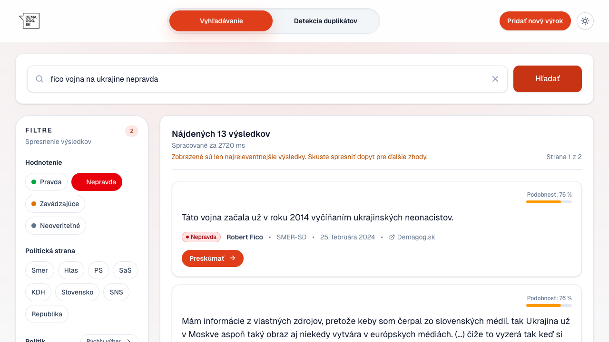
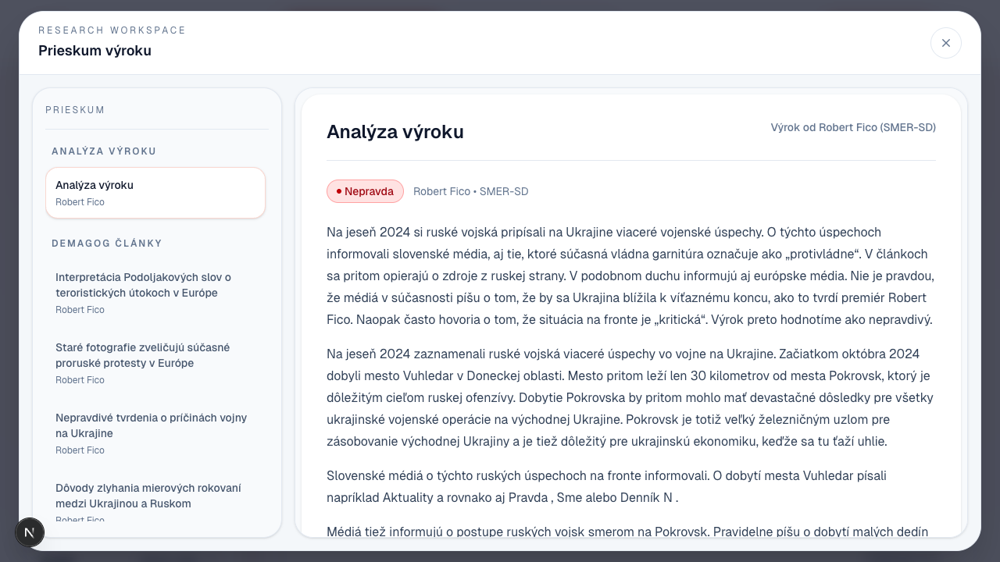
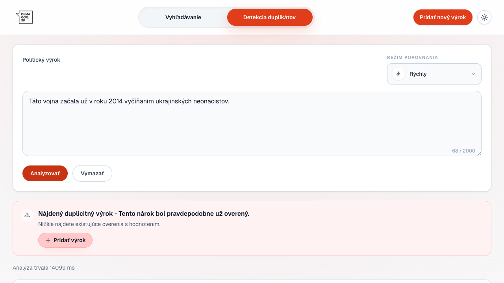
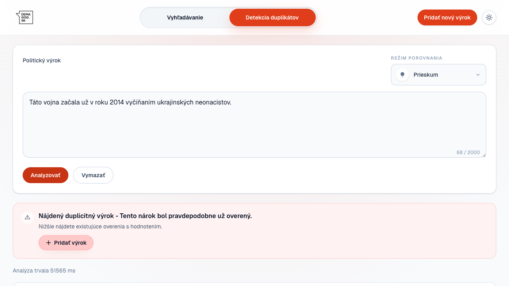
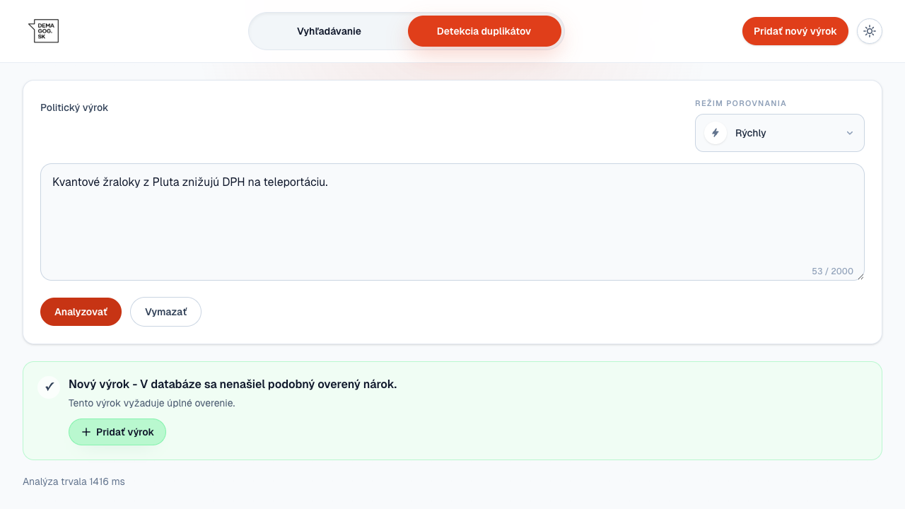
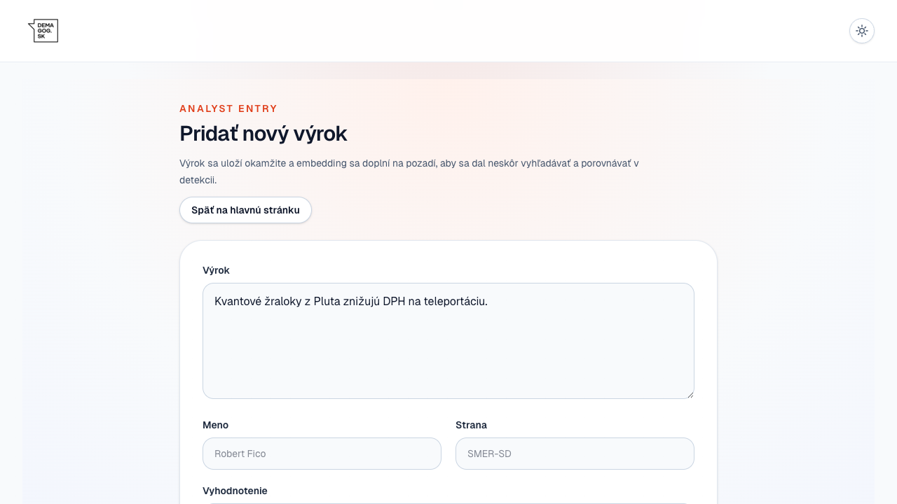

# AI vyhľadávanie a kontrola duplicít pre Demagog.sk

Táto ukážka je o tom, ako spraviť archív Demagogu prístupnejší pre bežné hľadanie aj pre redakčnú prácu. Namiesto presného dohľadávania starších formulácií pomáha nájsť relevantné overenia podľa významu, rýchlo preveriť nový výrok a plynulo pokračovať tam, kde treba.

Ak chcete rovno jednoduchý návod pre analytika, choďte na [Tutorial](#tutorial).

## Rýchle odkazy

- [Čo si z tejto ukážky odniesť](#čo-si-z-tejto-ukážky-odniesť)
- [Ako to vyzerá v praxi](#ako-to-vyzerá-v-praxi)
- [Pre koho je to užitočné](#pre-koho-je-to-užitočné)
- [Tutorial](#tutorial)

## Čo si z tejto ukážky odniesť

- Vyhľadávanie rozumie aj voľne napísanej otázke, nielen presnej citácii.
- Systém vie z dopytu sám odvodiť základné filtre a zúžiť výsledky.
- Pri novom výroku rýchlo ukáže, či už bol overený, či je len podobný, alebo či ide o nový prípad.
- Z nájdeného výsledku sa dá hneď prejsť do detailu a pokračovať v ďalšej práci.
- Ak sa zhoda nenájde, formulár na pridanie nového výroku nadväzuje bez zbytočného prerušovania.

## Ako to vyzerá v praxi

### 1. Stačí napísať, čo hľadáte

Pri dopyte „fico vojna na ukrajine nepravda“ systém pochopí, že ide o Roberta Fica, tému vojny na Ukrajine a výroky vyhodnotené ako nepravdivé. Používateľ tak nemusí ručne nastavovať každý filter zvlášť.

  

Takýto typ hľadania je užitočný vtedy, keď si človek pamätá tému a smer výroku, ale nie jeho presné znenie.

### 2. Fungujú aj celé otázky

Nástroj si poradí aj s prirodzenou otázkou typu „Čo povedali členovia SMER-u o vojne na Ukrajine od roku 2022?“. Sám rozpozná stranu aj časový rámec a vráti výsledky naprieč viacerými politikmi.

  

To je praktické najmä pri rešerši, keď človek ešte nehľadá jeden konkrétny výrok, ale chce sa zorientovať v širšej téme.

### 3. Z výsledku sa dá okamžite prejsť do detailu

Tlačidlo „Preskúmať“ otvorí pracovný pohľad s analýzou, článkami Demagogu a ďalšími zdrojmi. Používateľ tak nemusí preskakovať medzi viacerými miestami a môže pokračovať priamo z výsledku, ktorý ho zaujal.

  

Práve tu sa ukazuje, že nejde len o vyhľadávač, ale o nástroj, ktorý pomáha aj s ďalším krokom.

### 4. Pri novom výroku systém najprv skontroluje, či už nebol overený

Ak analytik vloží výrok, ktorý už v archíve existuje, detektor duplicít ho označí a hneď ukáže najbližšiu zhodu. To šetrí čas a znižuje riziko, že sa rovnaká práca začne od nuly.

  

Takýto výsledok je dôležitý hlavne pre redakciu, ktorá potrebuje rýchlo zistiť, či už má k dispozícii použiteľný základ.

### 5. Keď treba širší pohľad, je tu režim Prieskum

Popri rýchlom vyhodnotení je pripravený aj režim „Prieskum“. Ten je vhodný vtedy, keď nestačí iba najbližšia zhoda a treba si pozrieť širší súbor súvisiacich výrokov.

  

Takýto pohľad je užitočný najmä pri výrokoch, ktoré sa v čase vracajú v mierne pozmenenej podobe.

### 6. Ak sa zhoda nenájde, workflow pokračuje prirodzene

Nástroj vie rovnako jasne povedať aj to, že sa nič podobné nenašlo. V takom prípade ponúkne pokračovanie na pridanie nového výroku do databázy.

  

Po kliknutí sa otvorí formulár s predvyplneným textom výroku, takže používateľ nemusí začínať odznova.

  

Celý prechod tak pôsobí ako jedna súvislá práca, nie ako presun do iného, odpojeného nástroja.

## Pre koho je to užitočné

- Pre čitateľa alebo novinára, ktorý si chce rýchlo nájsť relevantné overenia k téme.
- Pre analytika, ktorý potrebuje zistiť, či už redakcia podobný výrok riešila.
- Pre tím, ktorý chce z archívu spraviť aktívne používaný pracovný nástroj, nie iba miesto na ukladanie starších výstupov.

Ukážky vyššie vznikli na reálnych dopytoch a výsledkoch z bežiacej aplikácie, aby bolo vidieť, ako sa produkt správa v praxi.

## Tutorial

Toto je najkratší návod pre človeka, ktorý si nechce študovať celý produkt. Ak si zapamätáte len jednu vec, tak túto: do vyhľadávania môžete písať normálne otázky a v detekcii stačí vložiť nový výrok. Systém vás potom vedie ďalej.

### 1. Kde začať

Na hlavnej stránke sú dva režimy:

- `Vyhľadávanie`: keď chcete nájsť, čo už Demagog o téme alebo výroku má.
- `Detekcia duplicít`: keď máte nový výrok a chcete zistiť, či už bol overený.

Ak neviete, ktorý režim použiť, začnite vyhľadávaním. Je to najjednoduchší spôsob, ako sa zorientovať.

### 2. Ako používať vyhľadávanie

Do vyhľadávacieho poľa píšte tak, ako by ste sa pýtali človeka. Nemusíte trafiť presné slová z archívu.

Dobré príklady:

- „fico vojna na ukrajine nepravda“
- „Čo povedali členovia SMER-u o vojne na Ukrajine od roku 2022?“
- „Pellegrini dane pravda“

Čo sa deje potom:

- systém si z textu často sám doplní filtre
- výsledky zoradí podľa toho, čo je najrelevantnejšie
- ak treba, môžete filtre ešte ručne upraviť vľavo

Najjednoduchší postup:

1. Napíšte otázku alebo tému do poľa.
2. Stlačte Enter alebo kliknite na `Hľadať`.
3. Pozrite si výsledky.
4. Ak vás niektorý zaujme, kliknite na `Preskúmať`.

Tlačidlo `Preskúmať` otvorí detail s analýzou, článkami a zdrojmi. Použite ho vždy, keď chcete ísť ďalej než len po zoznam výsledkov.

Ak sa vám filtre nastavili inak, než ste chceli, kliknite na `Resetovať filtre` a skúste dopyt znovu jednoduchšie prepísať.

### 3. Ako používať detekciu duplicít

Detekcia duplicít je určená na chvíľu, keď už máte konkrétny nový výrok a chcete rýchlo zistiť, či sa neopakuje niečo, čo už Demagog riešil.

Postup:

1. Prepnite sa na `Detekcia duplicít`.
2. Vložte celý výrok do poľa `Politický výrok`.
3. Vyberte režim.
4. Kliknite na `Analyzovať`.

Režimy sú dva:

- `Rýchly`: keď chcete čo najrýchlejšie zistiť, či už existuje zhoda.
- `Prieskum`: keď chcete širší pohľad na podobné výroky a viac kontextu.

Výsledok môže dopadnúť troma spôsobmi:

- `Nájdený duplicitný výrok`: veľmi pravdepodobne už existuje použiteľné staršie overenie.
- `Nájdené súvisiace výroky`: výrok nie je rovnaký, ale oplatí sa pozrieť si podobné prípady.
- `Nový výrok`: systém nenašiel nič dostatočne podobné.

Ak sa objaví užitočný výsledok, môžete otvoriť detail alebo pokračovať v prieskume. Ak ide o nový výrok, pokračujte na pridanie do databázy.

### 4. Kedy použiť Pridať nový výrok

Na pridanie nového výroku choďte vtedy, keď:

- detekcia povie, že ide o nový výrok
- alebo keď ste si po kontrole istí, že nič použiteľné v archíve nie je

Formulár sa dá otvoriť priamo z výsledku detekcie alebo cez tlačidlo hore v navigácii.

Čo vyplniť:

- text výroku
- meno
- stranu
- vyhodnotenie

Ostatné údaje doplníte podľa potreby. Ak ste prišli z detekcie, text výroku už bude predvyplnený.

### 5. Najkratšia verzia pre bežnú prácu

Ak chcete úplne jednoduchý postup, držte sa tohto:

1. Najprv skúste `Vyhľadávanie` a napíšte otázku normálnou vetou.
2. Ak máte konkrétny nový výrok, použite `Detekcia duplicít`.
3. Pri zhode otvorte detail alebo prieskum a overte si, či je výsledok naozaj použiteľný.
4. Ak zhoda nie je, pokračujte na `Pridať nový výrok`.

To je všetko, čo väčšina používateľov potrebuje vedieť na prvé používanie.
