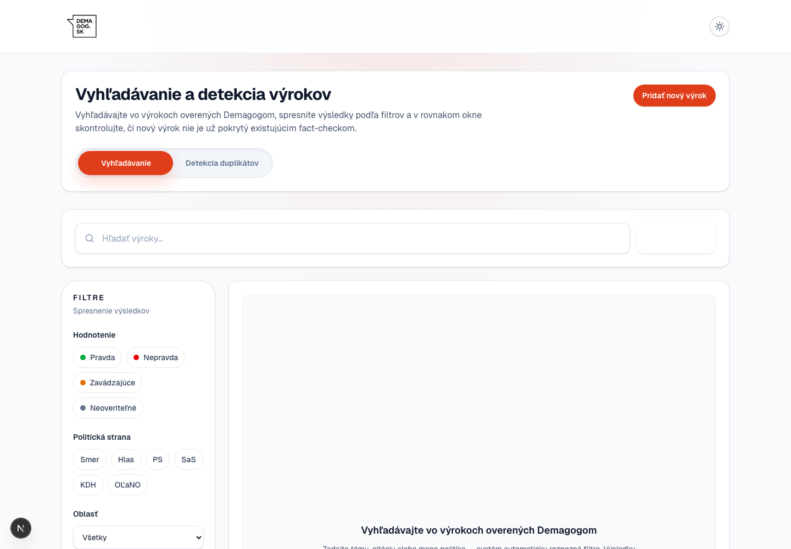
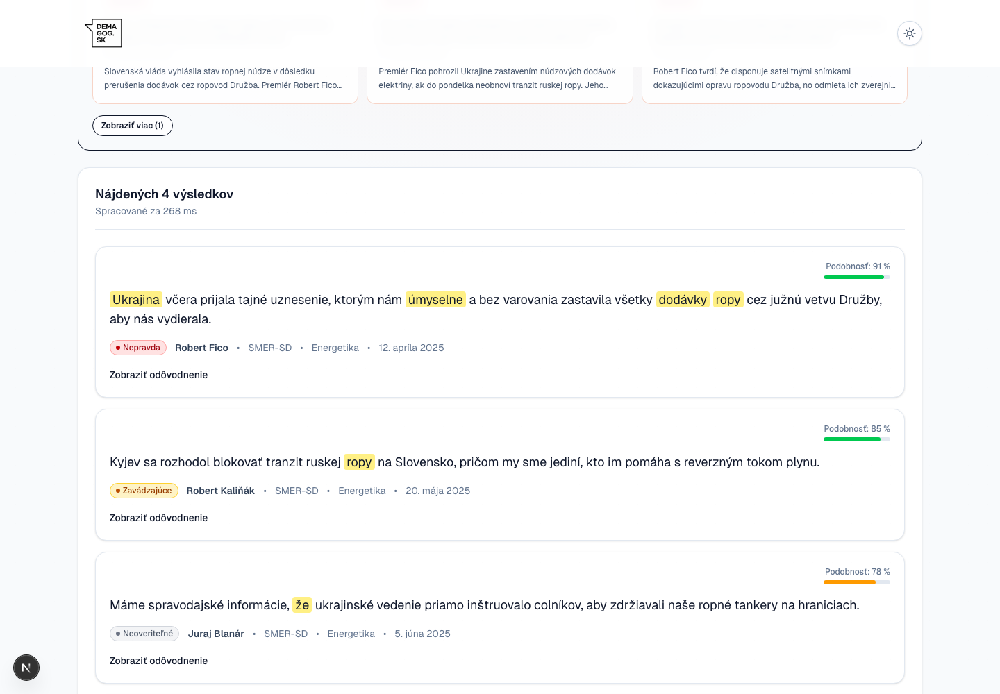
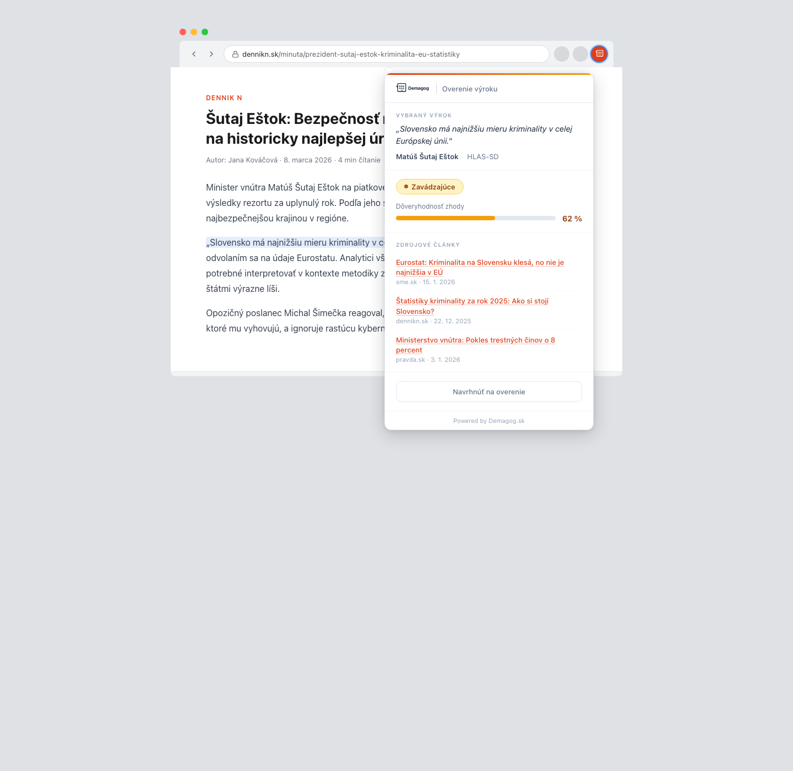

# Demagog.sk AI Search Showcase

This is a quick product showcase for a Demagog.sk toolset built around one simple idea: make Demagog's existing archive easier to use for both readers and analysts.

It combines two practical workflows:

- a better public search experience for finding existing fact-checks, even when the user does not know the exact wording
- an internal duplicate detector that helps analysts see whether a new claim has already been checked or overlaps with earlier work

The goal is not to replace editorial judgment. The goal is to reduce repetitive searching, surface relevant prior work faster, and help Demagog get more value from its own archive.

<p align="center">
  
</p>

## Why It Matters

Demagog already has the hard part: a valuable body of fact-checking work. What this prototype improves is access.

- Readers can find relevant fact-checks even when they search with different wording than the original statement.
- Analysts can immediately see whether a claim is likely a duplicate, only loosely related, or genuinely new.
- The workflow stays grounded in Demagog's own material instead of pretending to automate the editorial decision itself.

## What The Demo Shows

### 1. Smarter search for the public site

The search experience is designed to feel closer to how people actually ask questions. Instead of relying only on exact keywords, it can understand natural phrasing and return relevant verified statements from the archive.

### 2. Faster internal triage for analysts

When a new political claim comes in, the duplicate detector helps answer a very practical question: have we already checked this, or something very close to it? That means less manual digging and a faster start to the real fact-checking work.

<p align="center">
  
</p>

### 3. A browser-extension direction

The extension concept shows how this could eventually move even closer to the analyst's day-to-day workflow. A highlighted sentence in an article can be checked against existing Demagog material without forcing the user to leave the page.

<p align="center">
  
</p>

## Product Framing

This is best understood as a newsroom support tool:

- it helps people find prior checks faster
- it gives analysts a clearer starting point for new claims
- it keeps Demagog's archive useful, visible, and reusable

If the prototype proves useful, the natural next step is not a flashy redesign. It is a more polished version of the same core value: better retrieval, better research starting points, and less duplicated work.

## Local Preview

If you want to open the prototype locally:

```bash
npm install
npm run dev
```

The screenshots above were captured locally with Playwright from the app and from the extension mockup in [`extension-mockup.html`](extension-mockup.html).
